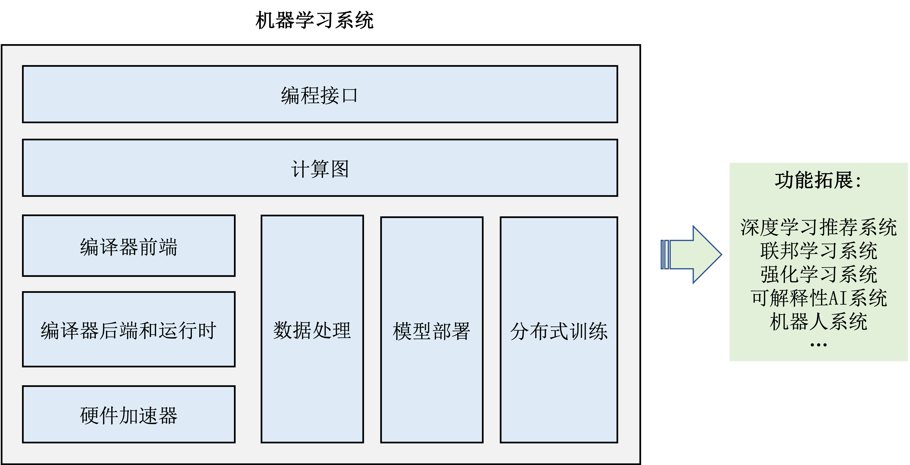

# 导论

## 机器学习系统设计目标

**机器学习系统含义**

机器学习系统也可以成为机器学习框架(如PaddlePaddle、Pytorch等)，其为机器学习算法开发者或机器学习用户提供一个软件系统，连接开发者和用户的代码和硬件系统。机器学习系统应当具备以下能力：支持多种神经系统、支持自动微分、支持数据管理和处理、支持模型训练和部署、高效使用硬件加速器（GPU等）、分布式计算。

**机器学习系统应该兼备神经网络开发库和大数据计算框架的功能。**

早期机器学习算法开发者会使用神经网络开发库进行开发，但是随着深度学习的发展，机器学习算法越来越依赖大数据进行学习，因此机器学习系统需要具备大数据快速存储、读取、计算等功能。

# 

## 机器学习系统基本组成

**编程接口**: 
包括Python、Java、Julia等高级编程语言，方便用户进行编程；同时包括底层C/C++接口，方便高性能编程。

**计算图**：
应用无关的计算图，适用于各种高级语言接口。计算图包含计算节点，节点之间的边表达计算依赖。计算图可以被同步和异步执行。

**编译器前端**：
对计算图进行优化，但是和硬件无关。（算法、实现上的优化？）包括：**中间表达，自动微分，类型推导和静态分析**等等。

**编译器后端和运行时**：
配合硬件的计算图优化。

**硬件加速器**：
类似CUDA?